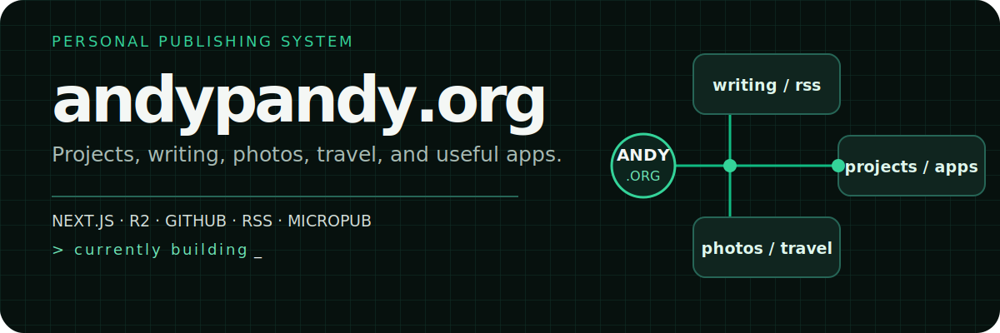

<p align="center">
  
</p>

<p align="center">
  <a href="https://andypandy.org"><strong>Visit andypandy.org</strong></a>
  ·
  <a href="https://andypandy.org/projects">Projects</a>
  ·
  <a href="https://andypandy.org/blog">Writing</a>
  ·
  <a href="https://andypandy.org/photos">Photos</a>
</p>

## One home for the things I make

This is the source for my personal site: a compact Next.js application where I
publish projects and writing, organize travel and photo records, and distribute
my own iOS builds. The public pages and the private publishing tools share one
codebase, with Cloudflare R2 as the content store.

The result is more than a portfolio shell:

- **Projects** presents 11 software and hardware builds and renders repository
  README details from GitHub.
- **Blog** stores Markdown in R2, renders GitHub-flavored Markdown, and exposes an
  RSS feed.
- **Photos and travel** add album management, EXIF editing, uploads, and a
  MapLibre-powered travel view.
- **Apps** publishes registered iOS builds with over-the-air install manifests.
- **Publishing adapters** support Micropub, Ghost Admin API, and selected
  WordPress-compatible endpoints.
- **Admin tools** manage posts, about-page copy, albums, photos, projects, and
  travel records.

## How the site fits together

```text
Browser
  │
  ├── /              about + timeline
  ├── /projects      GitHub-backed project catalog
  ├── /blog          Markdown + RSS
  ├── /photos        albums + EXIF
  ├── /travels       map and travel records
  └── /apps          iOS OTA distribution
          │
          ▼
Next.js routes and admin tools
  ├── Cloudflare R2     content, media, and state
  ├── GitHub API        project metadata and READMEs
  ├── Notion            optional publishing source
  └── Vercel            application runtime
```

## Run locally

Use Node.js 18 or newer.

```bash
git clone https://github.com/ChinesePrince07/andypandy-site.git
cd andypandy-site
npm install
npm run dev
```

Open [http://localhost:3000](http://localhost:3000). Pages backed by external
services need the corresponding environment variables; the static shell and
codebase remain useful without enabling every integration.

### Core environment

Create `.env.local` and provide the credentials for the features you want to
exercise:

```dotenv
ADMIN_PASSWORD=
GITHUB_TOKEN=

R2_ENDPOINT=
R2_ACCESS_KEY_ID=
R2_SECRET_ACCESS_KEY=
R2_BUCKET_NAME=
R2_PUBLIC_BASE_URL=
```

Optional integrations add their own values:

- `NOTION_TOKEN` and `NOTION_DATABASE_ID`
- `WHOOP_CLIENT_ID`, `WHOOP_CLIENT_SECRET`, and `WHOOP_PROXY_TOKEN`
- `IOS_UPLOAD_TOKEN`
- `PUBLISH_SECRET` and `REVALIDATE_SECRET`
- `AFILMORY_SITE_URL` and `AFILMORY_ADMIN_PASSWORD`
- `SITE_URL`

Never commit `.env.local` or production credentials.

## Repository map

```text
.
├── app/
│   ├── admin/         Authenticated content and media tools
│   ├── api/           Native APIs and publishing integrations
│   ├── blog/          Blog index and post pages
│   ├── photos/        Album and photo pages
│   ├── projects/      Project catalog and GitHub README views
│   ├── travels/       Travel map
│   └── apps/          iOS app distribution
├── components/        Shared UI and editors
├── content/           Versioned default content
└── lib/               Storage, publishing, project, and auth services
```

## Commands

| Command | Purpose |
| --- | --- |
| `npm run dev` | Start the local Next.js server |
| `npm test` | Run the Vitest suite |
| `npm run build` | Create a production build |
| `npm start` | Serve the production build |

## Design notes

The public UI uses a narrow editorial column, Space Grotesk headings, Geist body
and mono faces, and one restrained emerald accent. Motion respects
`prefers-reduced-motion`, while light and dark themes follow system preference
and can be changed manually.

## Repository status

This repository does not currently include a license file.
